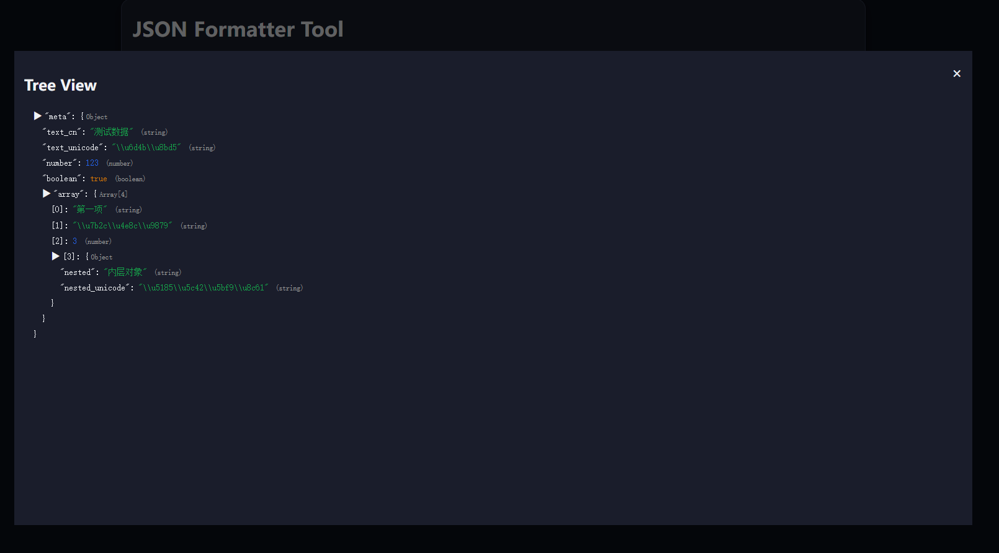

# JSON Formatter Tool

[🇬🇧 English](README.md) | [🇨🇳 中文](README.zh.md)

An ultra-lightweight web-based JSON formatter.  
Supports **beautify, minify, validate, tree view, and Unicode conversion**.  
No backend dependencies — works directly in the browser.

🔗 **Live Demo**: [https://tool.tl/en/json-formatter/](https://tool.tl/en/json-formatter/)

---

## ✨ Features

- **Beautify JSON** — pretty-print JSON with indentation  
- **Minify JSON** — compact JSON by removing whitespace  
- **Validate JSON** — check JSON syntax validity  
- **Tree View** — explore JSON structure in an expandable tree  
- **Unicode Tools** — convert between Chinese ↔ Unicode (`\uXXXX`)  
- **Copy Result** — one-click copy output to clipboard  
- **Responsive UI** — desktop & mobile support, with light/dark theme  

---

## 🚀 Usage

### Option 1: Open in browser
Clone or download the repo, then simply open `index.html` in any browser.

```bash
git clone https://github.com/yourname/json-formatter.git
cd json-formatter
open index.html   # or drag into your browser
```

### Option 2: Run with Node.js static server
Serve locally at `http://localhost:3000`:

```bash
# Install serve globally
npm install -g serve

# Start local server
serve .
```

Then visit:  
- English: [http://localhost:3000/en/json-formatter/](http://localhost:3000/en/json-formatter/)  
- 中文: [http://localhost:3000/zh/json-formatter/](http://localhost:3000/zh/json-formatter/)  

---

## 🌍 SEO

- **Title**: `JSON Formatter - Beautify, Minify, Validate | tool.tl`  
- **Description**:  
  `Free online JSON tool for beautifying, minifying, validating, tree view, and Unicode conversion. Supports beautify, minify, validate, tree view, and Unicode conversion.`  

Canonical & `hreflang` tags are automatically injected for `/zh/` and `/en/` routes.

---

## 📸 Screenshots

- Input / Output Panels  
  

- JSON Tree View  
  

- Unicode Conversion Tools  

  
  

---

## 📄 License

MIT License © [tool-tl](https://tool.tl)

---
