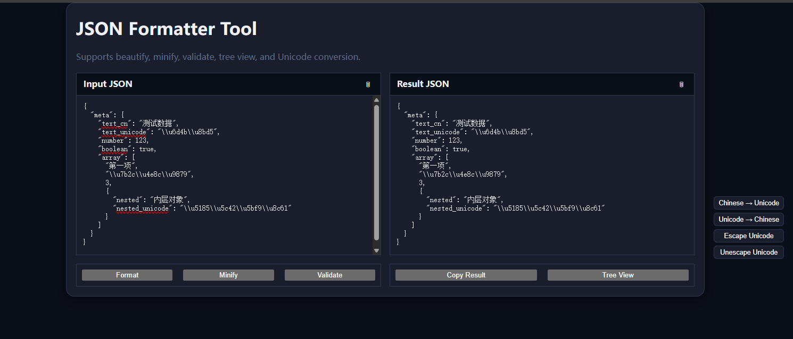
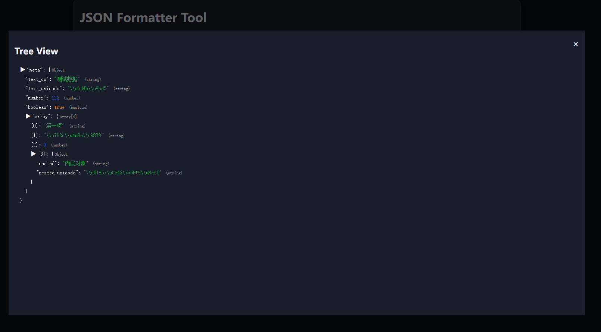
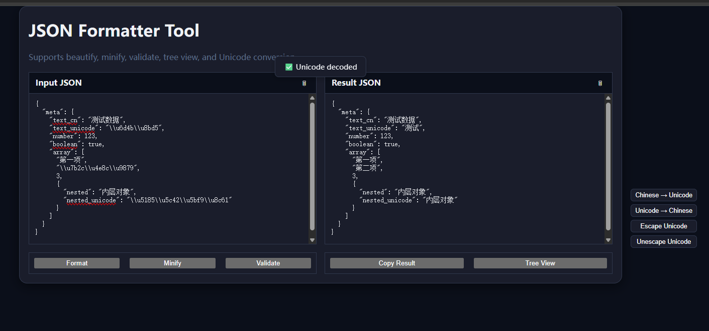
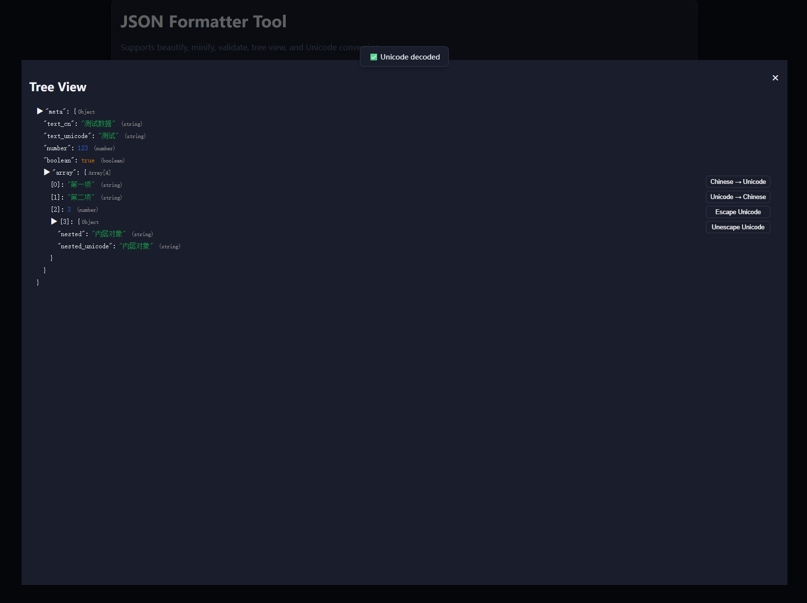

# JSON 格式化工具 (JSON Formatter Tool)

[🇬🇧 English](README.md) | [🇨🇳 中文](README.zh.md)

极简在线 JSON 工具，支持 **美化、压缩、校验、树形查看与 Unicode 转换**。  
无需任何后端依赖，直接在浏览器运行。

🔗 在线演示: [https://tool.tl/zh/json-formatter/](https://tool.tl/zh/json-formatter/)

---

## ✨ 功能特性

- **JSON 美化** —— 按缩进排版，便于阅读  
- **JSON 压缩** —— 移除空格和换行，输出紧凑格式  
- **JSON 校验** —— 检查输入是否是合法 JSON  
- **树形查看** —— 以可展开/折叠的树结构展示 JSON  
- **Unicode 工具** —— 中文 ↔ Unicode (`\uXXXX`) 转换  
- **一键复制** —— 快速复制结果到剪贴板  
- **响应式 UI** —— 支持桌面端与移动端，自适应深色模式  

---

## 🛠️ 使用方法

### 方式一：直接打开
克隆或下载代码，直接用浏览器打开 `index.html`。

```bash
git clone https://github.com/yourname/json-formatter.git
cd json-formatter
open index.html
```

### 方式二：使用 Node.js 启动静态服务
本地运行 `http://localhost:3000`：

```bash
npm install -g serve
serve .
```

然后访问：  
- 中文版: [http://localhost:3000/zh/json-formatter/](http://localhost:3000/zh/json-formatter/)  
- English: [http://localhost:3000/en/json-formatter/](http://localhost:3000/en/json-formatter/)  

---

## 🌍 SEO 设置

- 标题 (title): `JSON 格式化器 - 在线 JSON 美化、压缩、校验 | tool.tl`  
- 描述 (meta description):  
  `免费在线 JSON 工具，支持 JSON 数据的美化、压缩、校验、树形查看与 Unicode 转换，开发者必备。`

页面自动注入 **canonical** 与 **hreflang** 标签，支持中英文版本。

---

## 📸 界面预览

- 输入/输出区  
  

- 树形视图  
  

- Unicode 转换

  
  

## 📄 许可协议

MIT License © [tool-tl](https://tool.tl)
